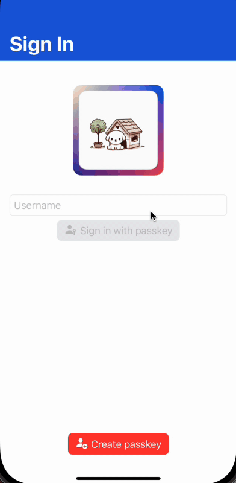

# iOS Client Reference

The purpose of this SDK is to be able to easily integrate [Passkeys](https://developer.apple.com/passkeys/) into your iOS app with the help of the [Passwordless.dev](https://bitwarden.com/products/passwordless/) management system.

## apple-app-site-association

Apple requires associated domains to be set up to perform passkey registration and assertions. For more details on setting up an apple-app-site-association, see [Apple's documentation](https://developer.apple.com/documentation/Xcode/supporting-associated-domains).

For Passkeys, you need to set up a `webcredentials` section for your app.

## Getting Started with the iOS SDK

### Swift Package Manager

The SDK can be added to your project via [Swift Package Manager](https://www.swift.org/package-manager/). You can then access the SDK functionality using `import Passwordless`.

### Initialization

The SDK provides a `PasswordlessClient` object that needs to be initialized with a `PasswordlessConfig` configuration. The configuration contains the API URL and API key needed to interface with [Passwordless.dev](https://bitwarden.com/products/passwordless/). It also requires the relying party ID and origin which represent your server that hosts an apple-app-site-association file with your app's team ID and bundle ID.

You will need to register with [Passwordless.dev](https://bitwarden.com/products/passwordless/) to obtain an API key.

Here is an example of a configuration:

```swift
let passwordlessClient = PasswordlessClient(
    config: PasswordlessConfig(
        apiUrl: "https://v4.passwordless.dev",
        apiKey: "<YOUR API KEY>",
        rpId: "demo.passwordless.dev",
        origin: "https://demo.passwordless.dev"
    )
)
```

### Registration

1. Request a registration token from your public RESTful API with the given username.
2. Pass the registration token to the `PasswordlessClient` via the `register(token:)` function. This will prompt the user to use biometrics to create the local private key needed for validation and send the public key to the Passwordless.dev API. Once complete, a verification token will be returned.
3. Pass the verification token to your public RESTful API to verify and return an authorization token. The user is now logged in to your app.


### Sign in

There are two approaches for Passkey Sign in: Auto Fill and Manual Entry.

#### A. Auto Fill

This is when the user taps the username field, and the keyboard appears. If the user taps the auto fill options above the keyboard, then this is the auto fill approach. For this to work correctly, you must call `signin` when your view first appears. This way, by the time the keyboard appears, the OS will have results ready to show.

1. Call `signin(alias: nil)` the your view first appears. Once complete, a verification token will be returned.
   - This function will wait until the user has tapped on an autofill item, it has been canceled in the Passkey dialog, or an error has occurred.
   - Based on the outcome of this response, your app will need to decide whether or not to restart the auto fill sign in process again.
   - If it is not running, then no options will show in the keyboard, so it usually makes sense to restart the process only in the `authorizationCancelled` case.
   - Getting an `authorizationError` may be a sign that something is not configured properly within your app, so it may be best to not rerun the auto fill to prevent endless looping errors.
2. Pass the verification token to your public RESTful API to verify and return an authorization token. The user is now logged in to your app.



#### B. Manual Entry

This is when the user types in a user name, and hits a button within the view to sign in. This will display a different version of the Passkey window for the user to select from.

1. Call `signin(alias:)` with a given alias. Once complete, a verification token will be returned.
2. Pass the verification token to your public RESTful API to verify and return an authorization token. The user is now logged in to your app.


